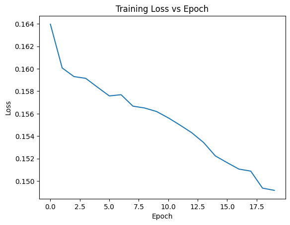
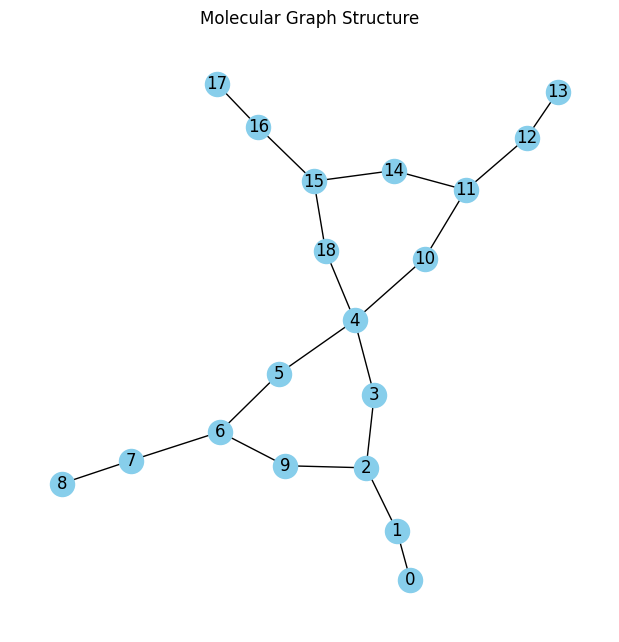
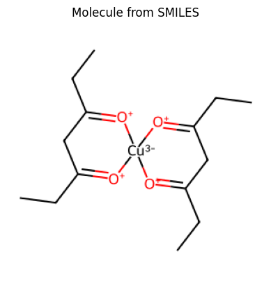

# GNN for Molecules and SMILES Visualization using OGBG-MolHIV

A Graph Neural Network (GNN) implementation using **PyTorch Geometric** to learn molecular graph representations from the **OGBG-MolHIV** dataset. The project also demonstrates molecular graph visualization and conversion of **SMILES (Simplified Molecular Input Line Entry System)** strings into chemical structures using **RDKit**.

# Overview

Graph Neural Networks (GNNs) have become an effective approach for learning from graph-structured data. Since molecules can naturally be represented as graphs, GNNs are widely used in computational chemistry, drug discovery, and bioinformatics.

This project implements a **Graph Convolutional Network (GCN)** using **PyTorch Geometric** to process molecular graphs from the **OGBG-MolHIV** dataset. The project also visualizes molecular graphs using **NetworkX** and reconstructs molecular structures from **SMILES** strings using **RDKit**.

# Features

- Graph Neural Network (GCN) implementation
- OGBG-MolHIV molecular dataset
- Graph representation learning
- Molecular graph visualization
- SMILES visualization using RDKit
- Training loss visualization
- PyTorch Geometric implementation

# Dataset

**Dataset:** OGBG-MolHIV

The dataset contains molecular graphs where:

- Nodes represent atoms
- Edges represent chemical bonds
- Each graph corresponds to a single molecule

The dataset is automatically downloaded using the **Open Graph Benchmark (OGB)** library.

# Model Architecture

The implemented Graph Neural Network consists of:

- Graph Convolution Layer (GCNConv)
- ReLU Activation
- Graph Convolution Layer (GCNConv)
- Global Mean Pooling
- Fully Connected Output Layer

The model is trained using:

- Adam Optimizer
- Binary Cross Entropy with Logits Loss (BCEWithLogitsLoss)

# Workflow

1. Load the OGBG-MolHIV dataset.
2. Split the dataset into training, validation, and testing sets.
3. Build the Graph Convolutional Network.
4. Train the model over multiple epochs.
5. Plot the training loss.
6. Convert a molecular graph into a NetworkX graph.
7. Visualize the molecular graph.
8. Read a SMILES string from the dataset.
9. Generate the corresponding molecular structure using RDKit.

# Results

# Training Loss

The training loss decreases steadily over multiple epochs, indicating that the Graph Neural Network is successfully learning meaningful molecular graph representations.



# Molecular Graph Visualization

Visualization of a molecular graph where atoms are represented as nodes and chemical bonds as edges.



# SMILES Visualization

Chemical structure reconstructed from its SMILES representation using RDKit.



# Technologies Used

- Python
- PyTorch
- PyTorch Geometric
- Open Graph Benchmark (OGB)
- RDKit
- NetworkX
- Matplotlib
- Pandas

# Repository Structure

```
gnn-for-molecules-and-smiles-visualization/
│
├── GNN_Molecules.py
├── GNN_Molecules_SMILES_Visualization_Report.pdf
├── README.md
└── results/
    ├── training_loss.png
    ├── molecular_graph.png
    └── smiles_visualization.png
```
# Applications

- Molecular Graph Learning
- Drug Discovery
- Bioinformatics
- Computational Chemistry
- Chemical Informatics
- Deep Learning on Graphs

# Future Improvements

- Evaluate model performance on the validation and test datasets
- Compute ROC-AUC evaluation metric
- Implement Graph Attention Networks (GAT)
- Compare GCN with GraphSAGE and GIN
- Train on additional molecular datasets such as QM9 and Tox21
- Predict properties of unseen molecules

# References

1. Hu, W., et al. **Open Graph Benchmark: Datasets for Machine Learning on Graphs.**
2. PyTorch Geometric Documentation
3. RDKit Documentation
4. Kipf, T. N., & Welling, M. **Semi-Supervised Classification with Graph Convolutional Networks (2017).**

# Author

**Revanth S**

B.Tech Artificial Intelligence & Data Science

Amrita Vishwa Vidyapeetham

---

⭐ If you found this project interesting, consider giving it a star.
